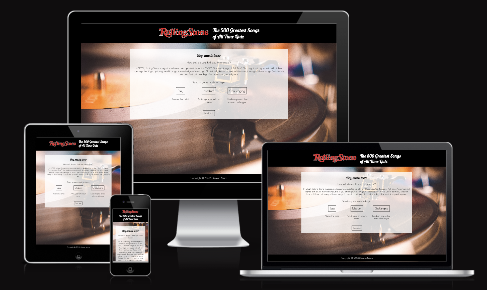
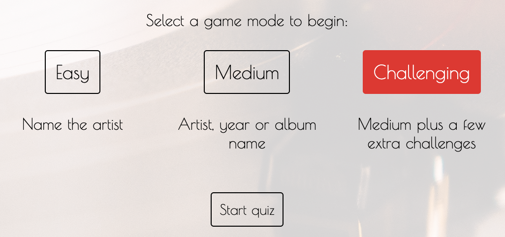
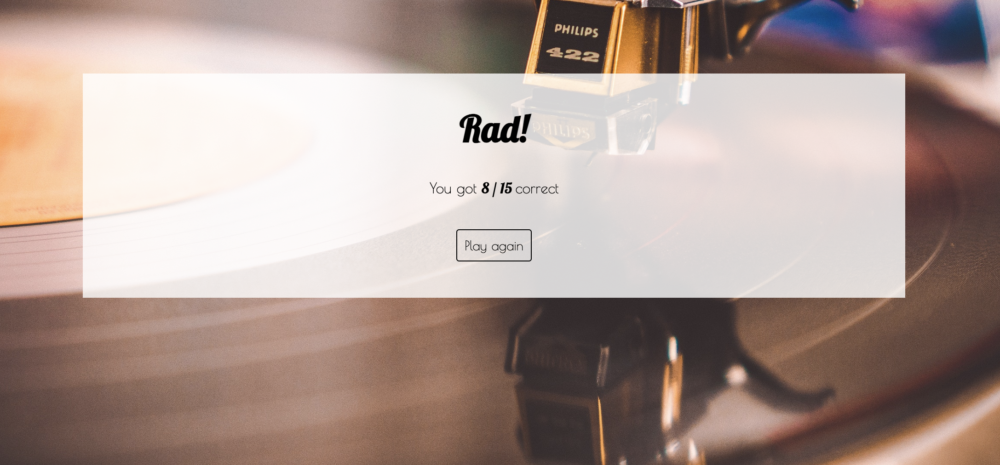
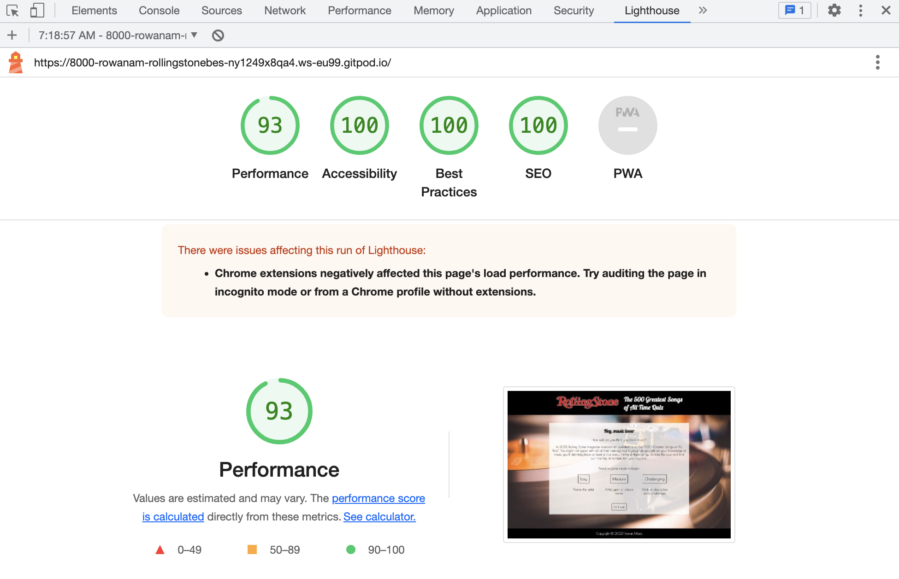
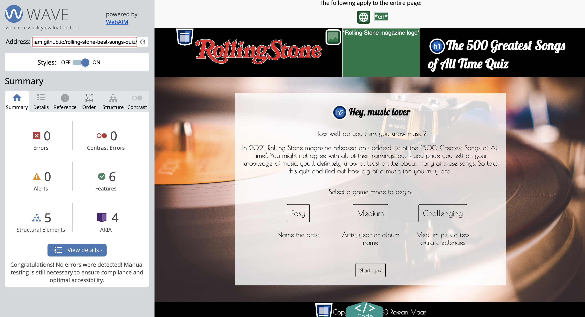

# Greatest Songs of All Times Quiz

This website provides a quiz game for music fans who want to test their knowledge of great popular music. The Rolling Stone magazine greatest 500 list was chosen as a well-known and comprehensive list of popular music in order to generate questions to test music enthusiasts.

For the user, the site provides a fun quiz game that tests their knowledge of popular music.

For the creator, the site demonstrates coding and design skills.

View the live website here - <a href="https://rowanam.github.io/rolling-stone-best-songs-quiz/" target="_blank">Greatest Songs of All Times Quiz</a>

## Creation Process - UXD

### Strategy

The goal of this project is to create a quiz game that generates interesting questions for a user and is highly interactive.

The user will likely be someone who is interested in and knowledgeable about music and wants to test their knowledge about popular music; someone who isn't as knowledgeable but wants to enjoy a short quiz; or someone who wants to learn more about popular music.

### Scope

This is a one-page website with one main feature, the quiz game.

The quiz has these main features: 
- three different difficulty levels
- generates random questions based on which categories are included in the selected difficulty level
- feedback on whether the user was correct or incorrect
- information about the correct answer
- control buttons to select answers and control the progression of the game

### Structure

The site has a simple structure, with a header and footer to provide basic site information and form, and the quiz as the page content.

The structure of the quiz game content will change, with elements being displayed and hidden at relevant points during the game.

### Skeleton

The developer created sketches of each stage of the quiz on paper.

The landing page has game background and instructions followed by game mode selection options.

When the quiz is active, the game mode buttons are displayed at the top of the screen. Underneath, the game displays the user's progression through the quiz (the number of questions answered). The quiz displays a question with four answer options, followed by a submit button that changes to a next question button when a guess is submitted. When the user guesses, information about the correct answer is displayed at the bottom.

After the quiz is finished, the result is displayed along with a button to play again.

### Surface

The site uses three fonts (all selected from [Google fonts](https://fonts.google.com/)):
- [Lobster](https://fonts.google.com/specimen/Lobster) - main headings and certain accent elements
- [Oswald](https://fonts.google.com/specimen/Oswald) - quiz question topics and answers
- [Poiret One](https://fonts.google.com/specimen/Poiret+One) - all other page text

Lobster and Poiret One were chosen as Rolling Stone magazine was at the height of its popularity in the 70's - 90's, and these decades are the most represented in the list - for this reason, the site uses design themes from this time period, including these two fonts. Oswald was chosen to complement these fonts but provide better readability, allowing the user to quickly figure out what the question is asking about and read the answer options.

Vinyl record images are used a few times on the site to emphasize the music theme. A vinyl background image provides color and texture to make the site more appealing. The answer option buttons are vinyl icons, an image which is also repeated in the favicon, to provide interactivity by spinning when hovered over or clicked.

The main theme colors are red and yellow, aligning with colors popular in the theme decades. The shade of red chosen (#ee1d25) was taken from the Rolling Stone magazine logo, for consistency.

## Songs

### Songs List

The songs that are used in this quiz come from Rolling Stone magazine's [The 500 Greatest Songs of All Times](https://www.rollingstone.com/music/music-lists/best-songs-of-all-time-1224767/) list (updated 2021 version).

### Songs Data

The data about the songs, stored in this project in songs.json, was pulled from Spotify by [MPK](https://www.marshallpk.com/#about) (Marshall Krassenstein). The process he used is described in [this article](https://www.marshallpk.com/post/rolling-stone-top-500/). The data he collected is posted on his site for public use, so a big thank you to him for collecting the data and making it public.

The developer of this project converted the data, which was in a CSV document, to a [JSON](https://www.json.org/json-en.html) file, removed some of the data categories and renamed the object properties to align with JavaScript standard syntax by removing dashes and converting the property names to camel case (e.g. artist-name to artistName).

## Features

### Header and Footer

The header and footer are simple and provide information about the site and copyright.

#### Header

Provides the site subject

#### Footer

Copyright information

### Starting Page

The landing page has 
- a greeting heading
- a short introduction to the songs list and the page
- information about the categories in each difficulty level
- buttons to select a game mode and start playing

All buttons turn red when hovered over, and when a game mode is selected that button turns red and the others return to default.

If the user tries to start the quiz without selecting a game mode, they will be alerted to make a selection before continuing.

### Active Quiz

When the user clicks "start quiz" on the landing page, the display changes to reveal the first quiz question.

The game mode buttons with the current game mode highlighted are displayed at the top of the page, followed by an answered count, the quiz questions and options and a "guess" button.

When the user hovers over a vinyl icon button, it spins, and gets bigger when clicked on. The other buttons will return to default size if this happens, and all buttons return to default when the next question is generated.

If the user tries to submit without selecting an option, they will be alerted to choose an answer.

When the user guesses, the "guess" button changes to a "next" button.

If they guessed correctly, the game will tell them this.

If they guessed incorrectly, they will be told this, and the correct answer will be displayed.

When the user clicks next, a new question is revealed, and the answer count is incremented to inform the user about their progress through the quiz.

### Game Finished Page

When the user finishes the game, a results page displays with
- a congratulatory message
- the number of correct answers
- a button to play again, which reloads the page to start again

### Quiz Questions

#### Game modes

Each mode give different categories of questions:
- Easy - the artist who performed the song
- Medium - the artist, album name or release year of the song
- Challenging - the same categories as medium, as well as the rank bracket of the song, its duration or a comparison question asking which song was the fastest

For the medium and challenging modes, where different categories are possible, a category is randomly selected for each question.

#### Answers

An array of 15 correct answers is randomly generated at the beginning of each quiz round.
- This means that each round will be different
- The function checks that a correct answer isn't already in the array so a quiz round won't ask about the same song twice

The incorrect answers for the round are generated for each question, and the function checks that the incorrect answers aren't the same as the correct one or duplicates of each other so that no set of options will have the same answer twice.

The quiz checks whether the user selected the correct answer by either pulling the correct answer from the generated list, or, for the tempo comparison queston, by checking which song of the answer options has the highest tempo and assigning it as the correct answer.

### Future Features

#### Extreme mode

Add another difficulty mode to ask more, challenging questions. This provides more entertainment for the user by creating more challenge and variety. It would also be interesting to use more of the data pulled from the list.

#### Correct answer extended information

Display more information about the correct answer - not just the property of the song relevant to the question category, but further information such as album cover, artist, and other data. This would make the quiz more interesting since the user can learn more while playing.

#### Keyboard input

Allow user to control the quiz with the keyboard by pressing numbers for answer options and "enter" for submit and next.

## Technologies Used

- [HTML5](https://developer.mozilla.org/en-US/docs/Glossary/HTML5)
- [CSS3](https://developer.mozilla.org/en-US/docs/Web/CSS)
- [JavaScript](https://developer.mozilla.org/en-US/docs/Web/JavaScript)
- [Fetch API](https://developer.mozilla.org/en-US/docs/Web/API/Fetch_API)

## Major Coding Challenges

### Generation of answers

Brackets was used to develop a function to generate a list of numbers that wouldn't repeat, and also add three other non-repeating answer options to each question in order to create the question options. These generated numbers between 0 and 500 would correspond to a song object in the data file and allow content to be pulled to create a question.

Some of the categories have very similar structures (e.g. artist name and album name), so creating these new question types was straightforward. However, some of the categories, such as rank bracket and fastest song, required extra steps or other approaches to generate and display answers. 
- For the rank bracket, the correct answer rank needed to be pulled but the answer options displayed as rank brackets, and four different brackets needed to be randomly generated.
- For the fastest song question, instead of asking about the property of one song, the four options needed to be compared to each other to determine the greatest of one of their properties.
- For the song length question, the song duration data needed to be converted from ms to a readable format of e.g. "4 mins 20 s"

### Checking correct answers

Checking whether the user selected the correct answer required for the correct answer to first be determined, a different process for several of the question types, and then to pull the HTML option element that corresponded to the correct answer.

While this was initially handled by one function, as question categories got added that determined the correct answer in different ways, a seperate function was introduced to determine the correct answer separately from the document element checking function.

### Storing which option selected

While less significant than the previous two, determining how to store which option the user selected either of the game modes or answer options, instead of immediately reacting to the click event on the element (thus allowing more user control over the quiz flow) proved a challenge initially.

The approach taken in this project was to add a "data-chosen" attribute to each option and run a function to set it to "true" when selected and reset the other options to "false", thus allowing the value to be read at a later point when needed.

## Bug Fixes

### Repeated answers

The initial version of the answer generation function ensured that data for the answer options would never be pulled from the same song object, however, if two different songs had the same artist, album name or other property in common it could result in a repeated answer.

This bug was resolved by checking that the answer values weren't repeated for each question, rather than just checking that different song object indices were used.

### Header overflow

At screen widths between standard tablet and mobile devices, the header content overflowed onto the rest of the page. This was fixed by reducing the size at a larger max-width than the rest of the content for mobile responsiveness.

### Accessibility

The header and footer background color was changed from orange to black as the foreground-background contract was not high enough.

Additionally, aria-labelledby attributes were added to the answer option buttons, as these were previously not connected to the answer content and would likely have posed an accessibility barrier.

### Performance

The background image was reduced in size after initial Lighthouse testing, which significantly improved performance and loading times.

## Known Bugs and Future Fixes

### Switch game mode

Currently, the game mode buttons are displayed above the quiz while the game is being run but they do not start a new game when clicked on. This is a feature that should be added, or have the buttons removed.

## Testing

### HTML Validator

- The website passed through the official [W3C HTML Validator](https://validator.w3.org/) with no errors

### CSS Validator

- The stylesheet passed through the official [W3C CSS (Jigsaw) Validator](https://jigsaw.w3.org/css-validator/) with no errors

### JS Linter

- The script passed through [JSHint](https://jshint.com/) with no significant errors
- There were several warnings, but the majority of these were related to syntax like "let" that is available in ES6

### Lighthouse

- The website was run through Chrome [Lighthouse](https://developer.chrome.com/docs/lighthouse/overview/) and got high performance and accessibility scores with no significant issues

### Wave

- The website was passed through [Wave](https://wave.webaim.org/) to check accessibility, with no errors flagged

### Personal Use

The developer tested the website for quiz functionality and design layout on Chrome, Firefox and Safari, and on a laptop and a mobile phone, as well as approximating other device sizes using Chrome Devtools.

Friends and family tested the website to check quiz functionality and intuitive use.

## Deployment

The project was deployed using [GitHub Pages](https://pages.github.com/)

The steps to deploy were as follows:
- Open the repository in GitHub
- Navigate to Settings
- Click on Pages
- The Source should be set to "Deploy from a branch"
- Under Branch, select "main"
- Click Save
- After waiting for the site to load and refreshing the page, the live site is available at the URL provided

## Attributions

- Rolling Stone logo - [Wikipedia](https://sco.wikipedia.org/wiki/File:Rolling_Stone_logo.svg)
- Vinyl icon - <a href="https://commons.wikimedia.org/wiki/File:LP_Vinyl_Symbol_Icon.png">Franci98my</a>, <a href="https://creativecommons.org/licenses/by/4.0">CC BY 4.0</a>, via Wikimedia Commons
- Background image - [Pexels](https://www.pexels.com/photo/black-and-gold-vinyl-record-player-3916058/), Photo by Matthias Groeneveld

### Content

The songs and associated information were taken from Rolling Stone magazine and MPK, as discussed above.

All other content was written by the developer.